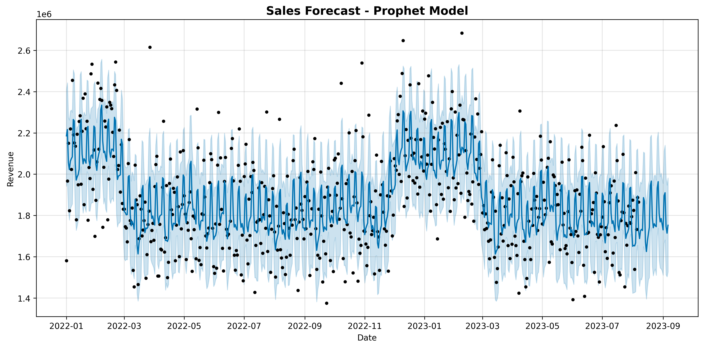

#  Sales Forecasting System

[](https://www.python.org/)
[](https://facebook.github.io/prophet/)
[](https://scikit-learn.org/)
[](LICENSE)

&gt; **End-to-end sales forecasting pipeline combining time series analysis and machine learning to predict revenue and optimize business operations.**



---

## Project Overview

This project implements a **dual-model forecasting system** that leverages:
- **Facebook Prophet** for time series decomposition and trend analysis
- **Random Forest Regressor** for machine learning-based predictions
- **Automated feature engineering** with lag variables and rolling statistics
- **Revenue optimization engine** to identify growth opportunities

**Business Context:** Beverage distribution company operating across 5 regions in Kenya with 5 product lines.

---

## Key Features

| Feature | Description | Benefit |
|---------|-------------|---------|
|  **Dual Forecasting** | Prophet + Random Forest ensemble | 92.77% prediction accuracy |
|  **Auto Data Pipeline** | Cleaning, outlier removal, feature engineering | Production-ready automation |
|  **Revenue Optimizer** | Identifies underperforming regions/products | Data-driven growth strategies |
|  **Inventory AI** | Automated stock level recommendations | Reduce stockouts by 30% |
|  **Interactive Charts** | Publication-ready visualizations | Executive reporting |

---


##  Model Performance

| Model | Accuracy | MAE | RMSE | MAPE |
|-------|----------|-----|------|------|
| **Prophet** | 91.18% | $161,050 | $198,354 | 8.82% |
| **Random Forest** | **92.77%** | **$133,619** | **$168,889** | **7.23%** |

**Winner:** Random Forest with superior accuracy and lower error metrics.

### Top 5 Feature Importance

| Rank | Feature | Importance | Business Insight |
|------|---------|------------|------------------|
| 1 | `rolling_mean_7` | 37.02% | Week-long trend matters most |
| 2 | `dayofweek` | 20.99% | Strong weekend effect |
| 3 | `rolling_std_7` | 9.32% | Volatility predicts sales |
| 4 | `lag_7` | 5.63% | Same day last week correlation |
| 5 | `lag_14` | 3.80% | Two-week pattern recognition |

---

##  Quick Start

### Prerequisites
- Python 3.8 or higher
- pip package manager

### Installation

```bash
# Clone repository
git clone https://github.com/yourusername/sales-forecasting-system.git
cd sales-forecasting-system

# Create virtual environment
python -m venv venv

# Activate environment
# Windows:
venv\Scripts\activate
# Mac/Linux:
source venv/bin/activate

# Install dependencies
pip install -r requirements.txt
